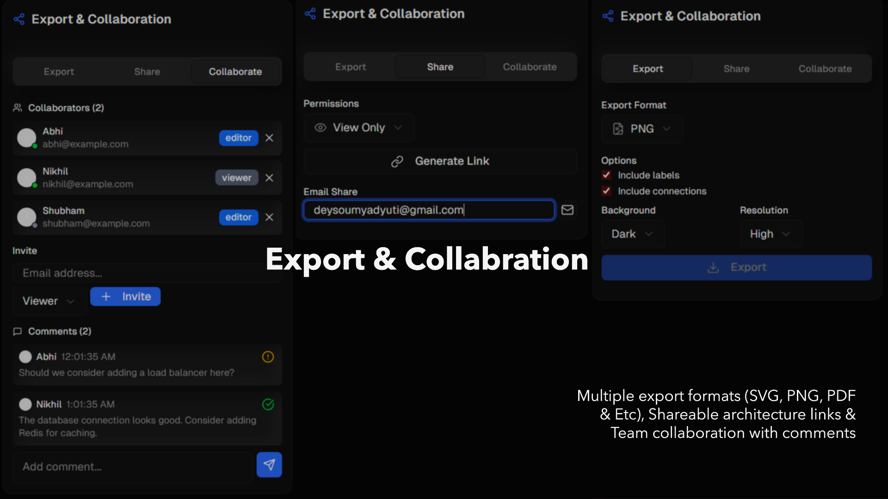

## ArchGen


AI-powered architecture generation platform. Turn natural-language requirements and budgets into optimized, visual software/cloud architectures with cost awareness.

> "From requirements to production-ready architectures in minutes"

 [GitHub](https://github.com/Soumo-git-hub/ArchGen)

---

## Contents
- Overview
- Core Features
- How It Works
- Screenshots (with captions)
- Quick Start
- Configuration
- API Reference
- Project Structure
- Security & Privacy
- Roadmap
- FAQ
- License

---

## Overview
ArchGen streamlines early-stage system design. Provide business requirements and constraints; ArchGen parses them, proposes an architecture across multiple views, and renders an interactive diagram you can refine and export.

## What ArchGen Solves
**The Problem**
- Translating vague business requirements into rigorous technical architectures is slow and error-prone
- Designing scalable systems within strict budget constraints
- Producing stakeholder-friendly visuals and documentation early
- Validating technical decisions before implementation

**The Solution**
- Visual architecture diagrams (system, business, technical)
- Budget-aligned designs with indicative cost estimates
- Deployment strategies and infrastructure recommendations
- NLP-powered requirements analysis with categorization and priority mapping

## Core Features
- AI-generated architectures from natural language requirements
- Multiple views: system, business, technical
- Interactive canvas with drag-and-drop editing and smart connectors
- Cost-aware recommendations and budget alignment
- Export: SVG, PNG, PDF, JSON, Docker Compose

### AI Architecture Generation
- Generate from natural language requirements
- Template + AI hybrid approach
- Intelligent component selection based on complexity and constraints

### Business-Oriented Design
- Budget constraint integration and cost awareness
- Stakeholder-friendly visualizations
- Requirements parsing and categorization
- Risk awareness and prioritization support

### Interactive Canvas
- Drag-and-drop editing with curved connections and smart routing
- Component library with dozens of pre-built elements
- Real-time-ready collaboration model

### Export & Collaboration
- Export formats: SVG, PNG, PDF, JSON, Docker Compose
- Shareable artifacts for teams and stakeholders

## How It Works
1) Parse requirements to extract goals, constraints, priorities.
2) Generate candidate architecture using templates + AI reasoning.
3) Render interactive diagram on the canvas for refinement.
4) Export and/or share results for stakeholders and implementation.

## Screenshots

*End-to-end AI generation of a system architecture from requirements.*


*Editable canvas with components, connectors, and layout tools.*


*Requirement parsing and categorization to guide design decisions.*


*High-level system view for technical stakeholders.*


*Business-oriented view for non-technical stakeholders and decision makers.*


*Export options (SVG/PNG/PDF/JSON/Docker) and collaboration workflows.*

## Tech Stack
- Next.js 14 (App Router), TypeScript, React
- Tailwind CSS, shadcn/ui components
- Next.js API routes; Google Gemini for architecture generation
 - Custom SVG-based architecture renderer
 - React hooks and context for state management

## Quick Start
1) Install
```bash
cd architecture-platform
npm install
```

2) Configure environment
```bash
cp .env.example .env
# Add your key:
# API_KEY=your_gemini_api_key_here
```

3) Run
```bash
npm run dev
# open http://localhost:3000
```

## Configuration
- API_KEY (required): Google Gemini API key used for generation.
- NODE_ENV (optional): development | production.

Store secrets only in `.env` (never commit).

## Use Cases & Examples
- Startup MVP Planning: input "E-commerce, 1k users, $200/month" → serverless (Lambda, DynamoDB, S3) ≈ $180/month
- Enterprise Application: input "Global SaaS, 100k users, HA" → multi-region + CDN + load balancers + autoscaling + DR
- Academic Project: input "University-scale student system" → classic 3-tier (React, Spring Boot, PostgreSQL)

## API Reference
Base path: `/api`

### POST `/api/generate-architecture`
Request
```typescript
{
  requirements: string,
  projectName?: string,
  complexity?: "low" | "medium" | "high",
  budget?: string,              // e.g. "$500/month"
  viewType?: "system" | "business" | "technical"
}
```
Response (example)
```json
{
  "architecture": {"nodes": [], "edges": []},
  "recommendations": ["use CDN", "serverless for burst"],
  "costEstimate": {"monthly": 180}
}
```

### POST `/api/parse-requirements`
Request
```typescript
{ text: string }
```
Response (example)
```json
{
  "functional": ["user auth", "catalog"],
  "nonFunctional": ["scalability", "availability"],
  "constraints": ["$200/month"],
  "priorities": ["MVP", "low latency"]
}
```

### POST `/api/export-architecture`
Request
```typescript
{
  architecture: unknown,
  format: "svg" | "png" | "pdf" | "docker" | "json"
}
```
Response
```json
{ "file": "base64 or downloadable payload" }
```

## Project Structure
```
architecture-platform/
├─ app/            # App Router routes and API endpoints
├─ components/     # UI components and canvas
├─ hooks/          # React hooks
├─ lib/            # Utilities
└─ styles/         # Tailwind & global CSS
```

## Scripts
```bash
npm run dev      # start development server
npm run build    # build for production
npm run start    # start production server
npm run lint     # run ESLint
```

## Validation & Results
- 85% cost accuracy (within ±15% of expert estimates)
- 90% component relevance
- ~3× faster design time vs. manual baselines
- 92% budget compliance in sample scenarios

Validated against AWS Well-Architected guidance, common patterns, and public cloud pricing (AWS/GCP/Azure).

## Security & Privacy
- No hardcoded secrets; environment-based configuration.
- Inputs validated server-side; avoid PII in requirements.
- Do not commit `.env` or share API keys.

## Performance & Limitations
- Near real-time generation (< 30 seconds typical)
- Best suited for greenfield projects; complex legacy integrations may need manual refinement
- Cost estimates are indicative (standard pricing; discounts not modeled)
- AI outputs require expert review before production

## Roadmap
- Terraform/CloudFormation export
- Real-time cost monitoring
- Architecture versioning and diffs
- Plugin ecosystem for custom components

## FAQ
- Why Gemini? Consistent, fast reasoning for architecture planning.
- Can I edit the diagram? Yes—drag, drop, connect, and export.
- Offline? Requires network for AI calls; local editing works once data is loaded.

## Contributing
1. Fork the repository and create a branch
2. Run `npm run security-check`
3. Submit a PR with a clear description and rationale

## Support
- Issues: use the repository issues tracker
- Discussions: start a thread in Discussions
- Email: your.email@domain.com

## Acknowledgments
- Google Gemini for generation
- Next.js team
- shadcn/ui component library
- Open-source community

## License
MIT
